# Google Forms Autofiller

An intelligent, privacy-first tool that extracts personal information from uploaded documents using OCR and a fine-tuned LayoutLMv3 model, stores it locally, and automatically fills Google Forms via a Chrome extension.

---

## Overview

Filling out Google Forms repeatedly with the same personal information is tedious. This tool solves that by:

1. Letting the user upload personal documents (ID cards, certificates, application forms etc.)
2. Automatically extracting key-value fields from those documents using OCR and a document understanding model
3. Storing the extracted profile locally on the user's machine
4. Automatically detecting and filling Google Form fields via a Chrome extension

Everything runs locally. No data ever leaves the user's device.

---

## Architecture

---

## Design Flow

### Stage 1 — Document Upload and Processing

1. User opens the web UI at `localhost:8000`
2. User uploads one or more documents (PDF, JPG, PNG)
3. The local FastAPI server receives the document
4. Tesseract OCR extracts raw text and bounding box coordinates from the document
5. The fine-tuned LayoutLMv3 model processes the OCR output (text + layout) and identifies key-value pairs
6. Extracted fields are returned to the web UI for user review and correction
7. Confirmed fields are saved to the local SQLite database

### Stage 2 — Google Form Autofill

1. User navigates to a Google Form in Chrome
2. The Chrome extension detects the Google Forms page
3. User clicks the extension icon and clicks Autofill
4. The extension reads all form question labels from the DOM using `[aria-label="Question"]`
5. The extension fetches the stored profile from the local server at `localhost:8000/profile`
6. A semantic field matching algorithm (TF-IDF + cosine similarity) maps form questions to extracted profile fields
7. The extension fills in each field using keyboard event simulation
8. User reviews the filled form and submits manually

---

## Components

### 1. Local Python Server (FastAPI)
- Receives document uploads from the web UI
- Orchestrates OCR and model inference pipeline
- Exposes REST API endpoints for the Chrome extension
- Manages the local SQLite database
- Runs as a background service on the user's machine

### 2. OCR Engine (Tesseract)
- Extracts raw text from uploaded document images
- Provides bounding box coordinates for each word
- Output feeds directly into the LayoutLMv3 model

### 3. Document Understanding Model (LayoutLMv3)
- Fine-tuned on the FUNSD dataset for form key-value extraction
- Takes OCR text and spatial layout as input
- Labels each token as a field key, field value, header, or other
- Output is a structured JSON profile of extracted fields

### 4. Local SQLite Database
- Stores extracted key-value profiles on disk
- No external database or cloud service required
- Supports multiple profiles and document sources

### 5. Web UI
- Simple interface for document upload
- Displays extracted fields for user review and correction
- Accessible at `localhost:8000` from the laptop browser

### 6. Chrome Extension (Still not decided how to be done)

---

## Field Matching Algorithm

Matching Google Form question labels to extracted profile keys is done semantically rather than by exact string matching. This handles cases like:

- "What is your First Name?" → `first_name`
- "Enter your phone number" → `phone`
- "Date of Birth" → `dob`

The approach is inspired by the clustering methodology in:
> Wang et al., "An Intelligent Framework for Auto-filling Web Forms from Different Web Applications", IEEE World Congress on Services, 2013

Steps:
1. Normalize both the form question text and the profile key (lowercase, remove stopwords, stem)
2. Compute TF-IDF vectors for each
3. Calculate cosine similarity between the form question and each profile key
4. Select the profile key with the highest similarity score above a confidence threshold
5. If no match exceeds the threshold, skip the field

---

## Model Training

The LayoutLMv3 model is fine-tuned for token classification on the FUNSD (Form Understanding in Noisy Scanned Documents) dataset.

- Base model: `microsoft/layoutlmv3-base`
- Dataset: FUNSD (199 annotated scanned forms)
- Task: Token classification with labels — question, answer, header, other
- Framework: HuggingFace Transformers + PyTorch
- Training platform: Kaggle (GPU)

Labels are mapped as follows:
- `question` → field key
- `answer` → field value
- `header` → section heading
- `other` → ignored

---

## Tech Stack

| Component | Technology |
|---|---|
| Local Server | Python, FastAPI |
| OCR | Tesseract (pytesseract) |
| Document Model | LayoutLMv3 (HuggingFace Transformers) |
| Model Training | PyTorch, HuggingFace Trainer API |
| Database | SQLite |
| Web UI | HTML, CSS, JavaScript |
| Chrome Extension | Not Decided |
| Field Matching | TF-IDF, Cosine Similarity |

---

## Privacy

- All document processing happens locally on the user's machine
- No documents, extracted data, or profile information is ever sent to an external server
- The local server is only accessible from the same machine (`localhost`)
- The SQLite database is stored on disk and never synced externally

---

## Potential Limitations

- Form filling is desktop/laptop only — Chrome extensions are not supported on mobile browsers
- Model accuracy depends on document quality and type — documents similar to standard forms perform best
- Google Forms DOM structure may change over time, requiring extension updates
- The local server must be running for the extension to function

---

## TODO

- [ ] **Profile Management:** Enable editing of data within already saved profiles.
- [ ] **Perspective Correction:** Implement 2D feature-based alignment (perspective correction using homography) to handle angled photos.
- [ ] **Document Classification:**
    - [ ] Check if feature detection for document type matching is viable.
    - [ ] If viable, decide which templates to use (e.g., Passport, Driver's License).
    - [ ] If viable, implement rule-based information extraction or explore YOLO (though less likely).
